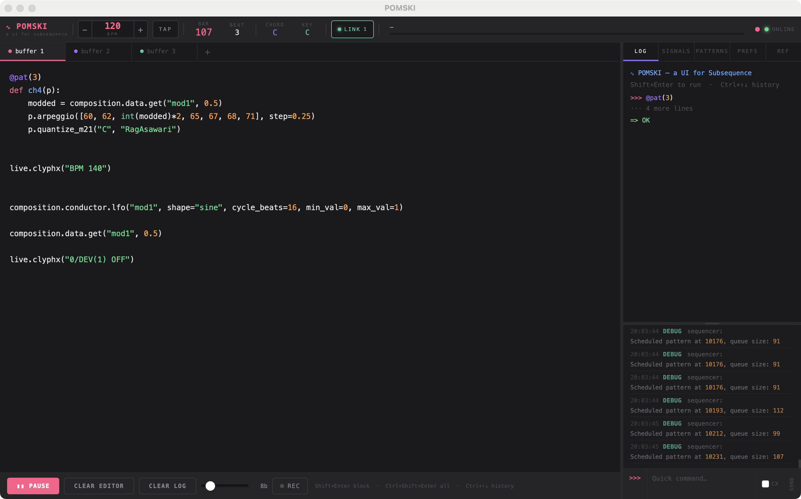
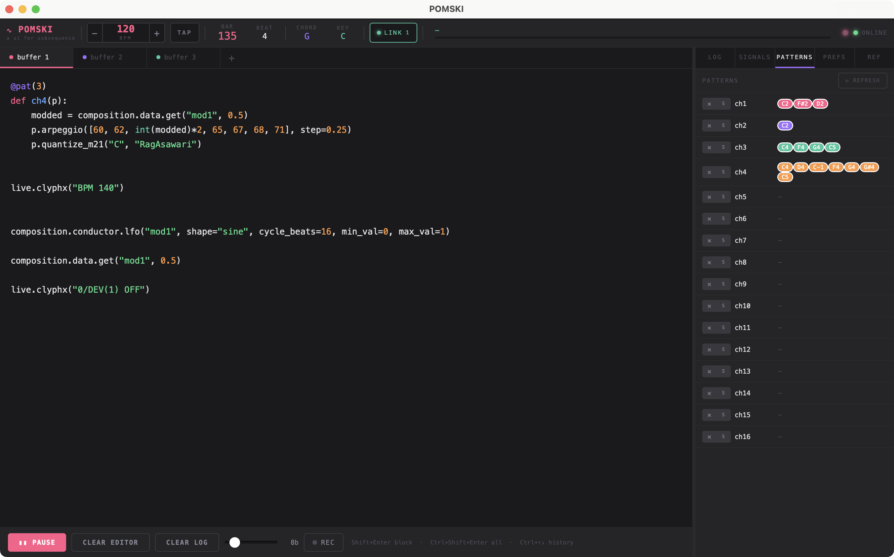
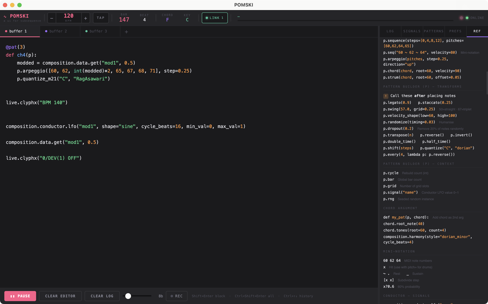

<div align="center">


# POMSKI

### Write music as code — and rewrite it while it's still playing.

*Python Only MIDI Sequencer Keyboard Interface — named after Qina, a very good Pomsky dog.*

<br>

[](https://github.com/ThinkInSound/POMSKI/releases/tag/macOS-v1.1.1)
[](https://github.com/ThinkInSound/POMSKI/releases/tag/Windows)

[](https://youtu.be/XUqHq8mggBk)
[](https://thinkinsound.github.io/POMSKI/docs/tutorial.html)
[](LICENSE)

</div>

<br>



<br>

## What is POMSKI?

POMSKI is a **musical instrument you play by typing**.

You write a few lines of Python describing a drum beat, a bassline, a chord progression — and it starts looping immediately. Change the code, press `Shift+Enter`, and the music updates on the next bar **without ever stopping**. No render button, no reloading, no silence.

It sends MIDI, so it drives whatever you already use: Ableton Live, Logic, a hardware synth, a drum machine, softsynths — anything that speaks MIDI.

**You do not need to be a programmer.** If you can write a shopping list, you can write a POMSKI pattern. The whole first section of the [tutorial](https://thinkinsound.github.io/POMSKI/docs/tutorial.html) is a Python primer written for musicians, not engineers.

---

## Get started

### 🍎 macOS

1. **[Download POMSKI for macOS](https://github.com/ThinkInSound/POMSKI/releases/tag/macOS-v1.1.1)** and unzip it
2. Drag `POMSKI.app` into your **Applications** folder
3. **Right-click** the app → **Open** → **Open**

> **Why right-click the first time?** macOS will warn that POMSKI is "from an unidentified developer." That's expected — POMSKI is free and open-source, and isn't signed with a paid Apple certificate. Right-click → Open tells macOS you trust it. You only need to do this once; after that, double-click as normal.

### 🪟 Windows

1. **[Download the installer](https://github.com/ThinkInSound/POMSKI/releases/tag/Windows)**
2. Run it — everything is bundled, no Python needed
3. Launch POMSKI from the Start menu or desktop shortcut

**📺 [Watch the setup video](https://youtu.be/XUqHq8mggBk)** — a full walkthrough of installing and running POMSKI on Windows.

### First launch

POMSKI asks which **MIDI output** to send to, then opens its window.

> ⏳ **The very first launch takes a little longer** (roughly 10–20 seconds) while POMSKI unpacks itself and installs its Ableton helper script. Every launch after that is fast. Point your DAW or synth at the MIDI port you chose, hit **PLAY**, and you're live.

---

## Your first pattern

Type this into the editor on the left and press `Shift+Enter`:

```python
@composition.pattern(channel=9, length=4, drum_note_map=drums)
def beat(p):
    p.hit_steps("kick_1",        [0, 6, 10],   velocity=110)
    p.hit_steps("snare_1",       [4, 12],      velocity=95)
    p.hit_steps("hi_hat_closed", range(16),    velocity=60)
```

That's a loop. It's already playing.

Now change `[0, 6, 10]` to `[0, 4, 8, 12]`, press `Shift+Enter` again — the kick pattern changes **on the next bar**, mid-playback. That loop of *edit → hear it → edit* is the entire point of POMSKI.

---

## A taste of what it can do

Every one of these is a complete, working pattern.

**A bassline that plays itself** — Euclidean rhythms spread hits as evenly as possible, the maths behind a huge amount of world percussion:

```python
@composition.pattern(channel=0, length=4)
def bass(p):
    p.euclidean(36, pulses=5, velocity=100)
```

**An arpeggio locked to a scale** — play any notes you like, then snap them all to D dorian:

```python
@composition.pattern(channel=1, length=4)
def arp(p):
    p.arpeggio([60, 64, 67, 71], step=0.25, velocity=80)
    p.quantize("C", "dorian")
```

**Melody from chaos theory** — the Lorenz attractor never repeats exactly, but always sounds coherent:

```python
@composition.pattern(channel=2, length=4)
def chaos(p):
    p.lorenz(steps=16, pitch_range=(48, 72), velocity=80)
    p.quantize("C", "minor")
```

**Let POMSKI handle the chords** — set a harmonic style once and every pattern follows the progression:

```python
composition.harmony(style="functional_major", cycle_beats=4, gravity=0.8)
```

**Modulate anything with an LFO** — a slow sine wave driving note velocity:

```python
composition.conductor.lfo("swell", shape="sine", cycle_beats=16)

@composition.pattern(channel=0, length=4)
def pulse(p):
    vol = p.signal("swell")                       # 0.0 → 1.0, sweeping
    for i in range(8):
        p.note(60, beat=i * 0.5, velocity=int(40 + vol * 80))
```

**Change tempo, mute, and rewrite — live:**

```python
composition.set_bpm(140)
composition.mute("bass")
composition.target_bpm(96, bars=8, shape="ease_in_out")   # smooth 8-bar ramp
```

There's much more — L-systems, cellular automata, 1/f noise, Markov chains, pitch bend, microtuning, and a Narmour-model melody generator. All of it is in the **[full tutorial and API reference](https://thinkinsound.github.io/POMSKI/docs/tutorial.html)**.

---

## The interface

POMSKI runs in its own window (or any browser at `http://localhost:8080`).

**Editor** — three tabs of scratch space. `Shift+Enter` sends the block your cursor is in; `Ctrl+Shift+Enter` sends everything. Your work is saved between sessions.

**Topbar** — tempo (drag it, or TAP it in by feel), bar/beat counters, the current chord and key, and Ableton Link status.

| | |
|---|---|
|  | **Patterns** — every running loop, with mute and clear buttons. The coloured pills are the actual pitches in each pattern; they light up as they play. |
|  | **Ref** — a searchable cheat sheet of every method, built right into the app, so you never have to leave to look something up. |

**Log** — everything you send and everything POMSKI says back, in colour. Errors show the full traceback here instead of hiding in a terminal.

**Signals** — live scrolling graphs of your LFOs and ramps, so you can see your modulation instead of guessing.

**Prefs** — MIDI device selection, Ableton Link toggle, and connection status.

### Keyboard shortcuts

| Keys | What it does |
|---|---|
| `Shift+Enter` | Send the current code block |
| `Ctrl+Shift+Enter` | Send the whole editor |
| `Ctrl+↑` / `Ctrl+↓` | Step back through command history |
| `Tab` | Indent (4 spaces) |

---

## Ableton Live

POMSKI is built to sit alongside Live rather than replace it.

### Ableton Link — tempo sync

Link keeps POMSKI locked to Live's tempo (and to anything else on your network that speaks Link — Live, Traktor, Reason, loads of iOS apps). Change tempo in either place and both follow. Toggle it from the Prefs tab.

### AbletonOSC — control the session

Install [AbletonOSC](https://github.com/ideoforms/AbletonOSC) as a Control Surface in Live, and POMSKI can drive your set from Python:

```python
live.clip_play(0, 0)             # fire a clip
live.scene_play(2)               # fire a scene
live.track_volume(0, 0.85)       # mixer
live.device_param(0, 0, 3, 0.5)  # any device parameter

live.watch("track/0/volume")     # stream a Live value into your patterns
```

### ClyphX — action macros, included

**POMSKI bundles [ClyphX](https://github.com/ldrolez/clyphx-live11) and installs it for you** on first launch — no purchase required. Just add **ClyphX** as a Control Surface in Live's preferences (alongside AbletonOSC) and restart Live.

```python
live.clyphx("BPM 128")
live.clyphx("1/MUTE ON")
live.clyphx("1/DEV(1) ON ; 2/ARM ON")
```

> ClyphX **Pro** is a separate paid product from [Isotonik Studios](https://isotonikstudios.com/product/clyphx-pro/). You only need it for `live.clyphx_osc()` (X-OSC). Everything shown above works with the free version POMSKI ships with.

---

## Full documentation

The complete tutorial — Python primer for musicians, step-by-step track walkthrough, every `p.` method, the algorithmic composition library, and performance tips — lives here:

### 📖 **[thinkinsound.github.io/POMSKI](https://thinkinsound.github.io/POMSKI/docs/tutorial.html)**

It's also built into the app: open the **Ref** tab and click **Open Full Tutorial**.

---

## Troubleshooting

**MIDI light blinking but no sound**
Your DAW or synth isn't listening to the port POMSKI is sending to. Check the Prefs tab to see which device is selected, and make sure your instrument track's input matches.

**Everything went silent (Windows, LoopBe users)**
LoopBe mutes itself if it detects a MIDI loop — its tray icon turns red. Right-click it and reset the port.

**A pattern didn't change when I sent it**
Use the **same function name** as the pattern you're replacing. A new name creates a *new* pattern instead of updating the old one.

**macOS says the app is damaged or from an unidentified developer**
Right-click the app → **Open** → **Open**. See [Get started](#-macos) above.

---

## Build from source

Only needed if you want to modify POMSKI or run it on a platform without a prebuilt download. Requires **Python 3.10–3.13** (3.14 is not yet supported — `python-rtmidi` doesn't build on it).

```bash
git clone https://github.com/ThinkInSound/POMSKI.git
cd POMSKI
pip install -e .
```

> Use `git clone`, not the ZIP download — the ZIP is missing files the installer needs.
> On macOS, use `pip3` instead of `pip`.

Optional extras:

```bash
pip install mido python-rtmidi   # MIDI device selection
pip install music21              # extended scales + microtuning
pip install aalink               # Ableton Link tempo sync
```

Run it:

```bash
cd examples
python pomski_template.py
```

Then open **http://localhost:8080**.

### Packaging an app bundle

```bash
pip install pyinstaller

# macOS  → dist/POMSKI.app
pyinstaller pomski_mac.spec -y --clean

# Windows → dist/POMSKI/POMSKI.exe
pyinstaller aalink_bridge.spec        # build the Link bridge first
pyinstaller pomski.spec -y --clean
iscc pomski_installer.iss             # optional: build the installer
```

---

## Credits & license

POMSKI is a fork of **[subsequence](https://github.com/simonholliday/subsequence)** by Simon Holliday, extended with the web UI, Ableton Link sync, AbletonOSC and ClyphX bridges, the music21 integration, and a Max for Live device on the way. The original copyright and licence are preserved.

Bundled [ClyphX](https://github.com/ldrolez/clyphx-live11) is LGPL-3.0, © its respective authors.

POMSKI itself is **AGPL-3.0**. If you run a modified version as a network service, you must make your source available to its users. See [LICENSE](LICENSE).

<div align="center">
<br>
<sub>Made for people who'd rather play with music than wait for it to render.</sub>
</div>
